# 鸟类识别模型训练与部署

本文档记录使用MobileNetV3_Small模型对图片二分类（有鸟和无鸟），并将模型转换格式后部署到rockchip rv1103开发板上。文档内容主要分为两大部分：深度学习训练模型、板端部署模型进行推理。

## 深度学习方面

深度学习方面主要可以分为以下几个部分：模型选择、模型训练、模型结果、模型性能分析

### 模型选择

由于板端资源受限，因此希望寻找一个尽量小的分类模型。有MobileNetV3_Small和MobileNetV3_Large两个待选项，也有一些物体检测的小模型，例如：NanoDet-plus。上面介绍的模型可以参考以下blog。MobileNetV3_Small在两类数据中训练后为5.92MB，MobileNetV3_Large在两类数据中训练后为16.2MB。后续的训练均以MobileNetV3_Small为研究对象。

[轻量级神经网络MobileNet全家桶详解-CSDN博客](https://blog.csdn.net/qq_37555071/article/details/108393809)

[深度学习在图像处理中的应用（tensorflow2.4以及pytorch1.10实现）-CSDN博客](https://blog.csdn.net/qq_37541097/article/details/103482003)

[超简单辅助模块加速训练收敛，精度大幅提升！移动端实时的NanoDet升级版NanoDet-Plus来了！ - 知乎 (zhihu.com)](https://zhuanlan.zhihu.com/p/449912627)

对MobileNetV3_Small和MobileNetV3_Large进行简单的比较，这两个网络基于同样的backbone。两模型仅在主干网络的层数上有所不同（见下图）。

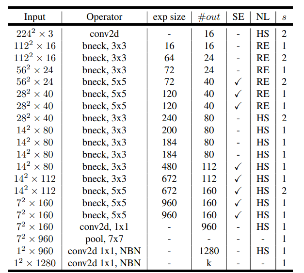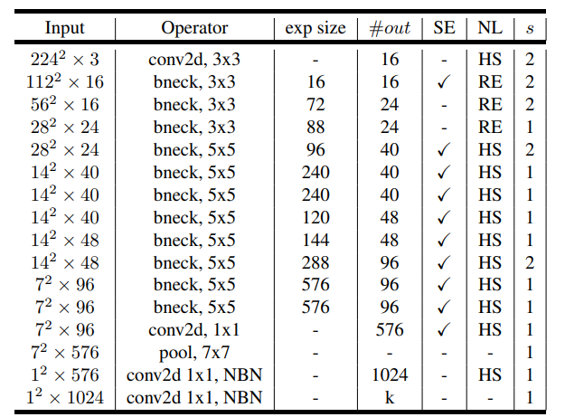

该网络的主干结构倒残差模块，如下图所示。主要包含逐点卷积、深度卷积、SE注意力机制、逐点卷积以及最外层的残差模块。这里需要注意注意力机制和残差模块并非每个backbone都有使用。

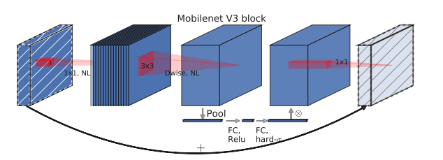

网络结构的搭建使用的是github中已经搭建好的网络，参考github仓库 [WZMIAOMIAO/deep-learning-for-image-processing: deep learning for image processing including classification and object-detection etc. (github.com)](https://github.com/WZMIAOMIAO/deep-learning-for-image-processing) ，该仓库中包含很多网络结构，方便使用。

### 模型训练

该部分主要介绍使用到的数据集的具体情况，以及训练时各种参数对模型结果的影响。

#### 数据集介绍

使用该网络做二分类任务，数据包含两部分含鸟的图片和不含鸟的图片。根据数据的来源又可以分为真实喂鸟器拍摄到的图片和网络上搜集到的鸟类的图片（含鸟）和北美庭院的环境图片（不含鸟）。真实喂鸟器的视频大概1000个，对其提取有鸟帧和无鸟帧。提取原则是每个视频3-4张有鸟图片，以及1-2张无鸟图片。部分视频中可能不存在无鸟的帧。

视频总体上分为三个部分，训练集、验证集和测试集。总体数量比例为6：2：2。在实际训练中还会在训练集中添加网络上搜集到的数据，下面介绍。

网络上搜集到的含鸟图片数量庞大，这里仅考虑会出现在喂鸟器镜头下的部分鸟类，从中提取1500张图像。网络上搜集到的北美庭院无鸟图片1131张。这部分数据会与真实场景中的测试集的数据混合得到最终的训练集。

#### 参数的影响

下面主要根据训练的结果，经验性地总结一些参数对模型的定性影响。模型训练时的参数主要包括：模型训练的轮次、数据集batchsize的设置、是否使用预训练参数、模型学习率。

模型训练的轮次设置为100，绘制训练过程中训练集和测试集的loss曲线和准确率曲线。训练中会在迭代中始终保存准确率提升地模型，后续可以根据曲线选择一个准确率最高且不会过拟合的模型。

数据集batchsize的设置对模型的影响从结果上看可以认定为误差，模型训练设置的是128。

在测试中发现使用预训练参数的效果比较好，预训练参数更具泛化性，在实际场景的数据集有限的情况下应加载与训练参数进行迁移学习。同时在训练时要将模型的feature层的参数不进行冻结，以便模型学习数据集的特征。如果冻结，模型在训练过程中仅调节classifier层的参数。

模型的学习率保持默认值0.0001，迁移学习仅对模型进行微调选择较小的学习率。

#### 模型结果

该部分用于记录模型在训练过程中的结果，监测模型训练过程中损失值和模型在验证集上的准确率。考虑到量化的问题，该部分针对以下情况训练模型并比较它们的表现，是否调整模型预训练的参数极值（为什么选择这两种情况进行对比的原因将在板端部署部分解释）。

##### 调整模型预训练参数的结果

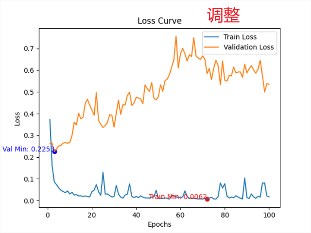

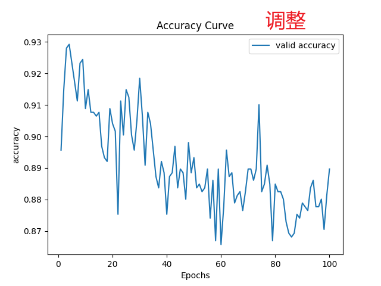

##### 未调整模型预训练参数的结果

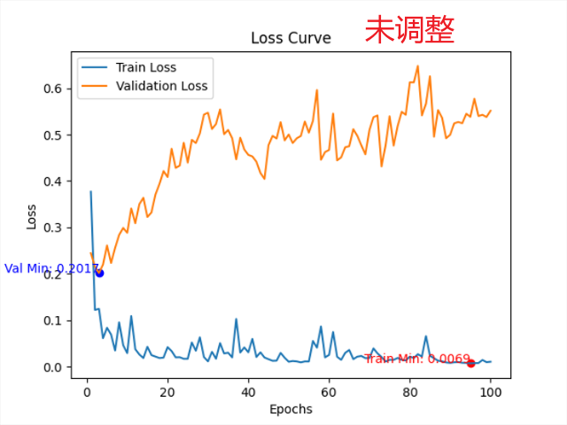

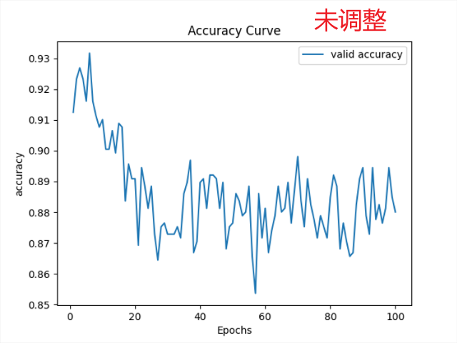

#### 模型性能分析

模型性能分析为测试不同模型在上述提到的测试集数据上的正确率以及TSNE可视化结果。根据模型的表现推测可能的原因。

##### 调整模型预训练参数在测试集上的结果

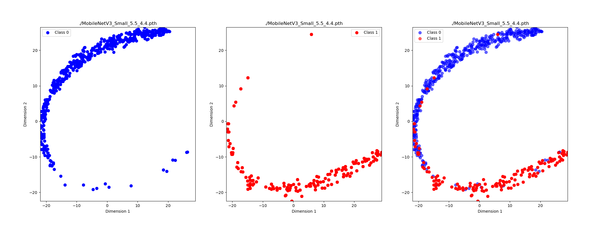

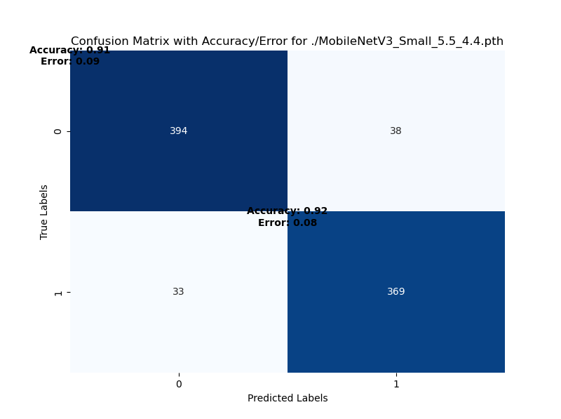

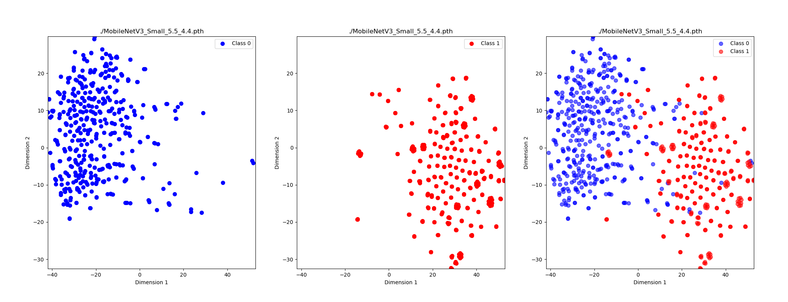

##### 未调整模型预训练参数在测试集上的结果

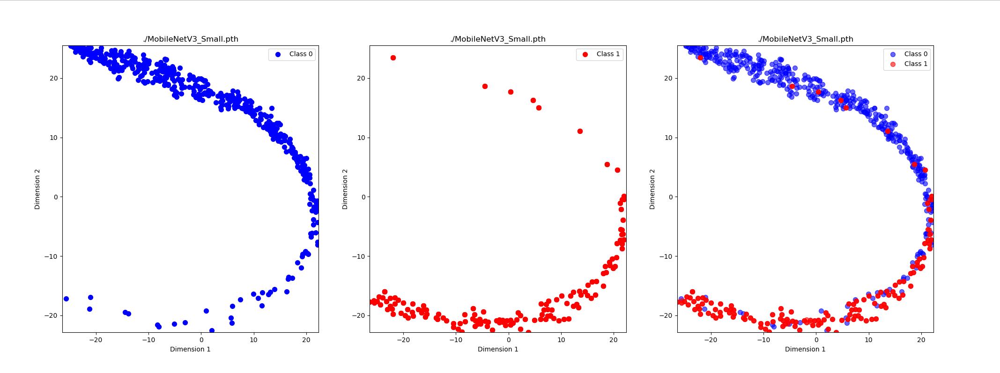

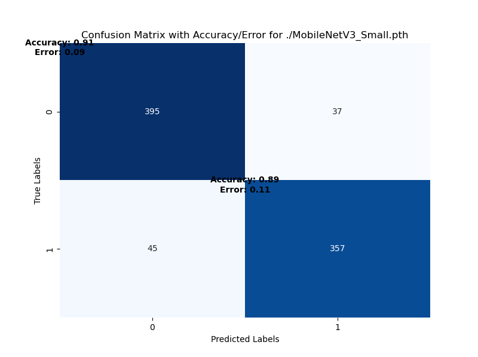

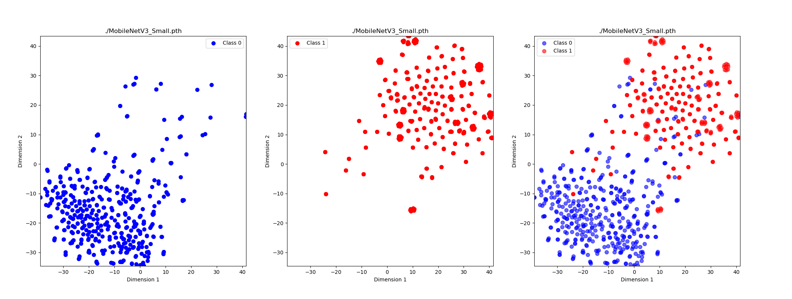

##### 结果分析

分析上面的测试结果可以知道，是否调整模型的outlier值对模型的准确率影响不大。但是在后面的板端测试中，我们会发现调整outlier减小参数范围后极大的提高了模型量化的性能。

## 板端部署模型

板端部署方面主要分为工具链介绍、模型量化转换、模型推理代码构建、推理结果分析与优化。公司选择的处理芯片是RK1103，该芯片基于Cortex A7架构，主频1.2GHz，NPU神经网络处理单元算力0.5TOPS，支持int4、int8、int16数据计算。芯片自带ISP单元支持最大4M@30fps输入，芯片内存为64MB DDR2。芯片flash闪存仅16MB。下图展示的是luckpico-plus开发板，与要求的芯片一致，该开发板的使用说明如下 [入门指南与资料下载 | LUCKFOX WIKI](https://wiki.luckfox.com/zh/Luckfox-Pico/Download/)。

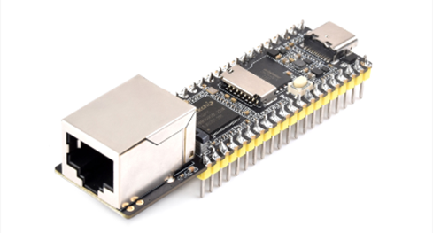

### 软件工具链介绍

板端部署方面大量使用rockchip公司提供的API以及示例代码，现对其进行介绍。下图展示了整体的运行逻辑。

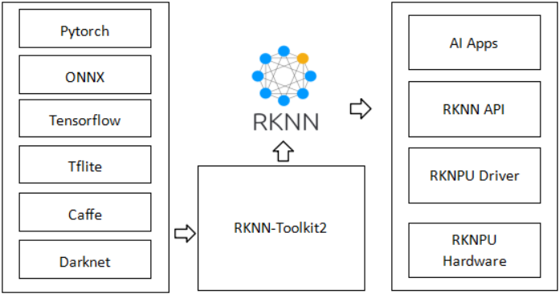

第一部分是下面的github仓库 [airockchip/rknn_model_zoo (github.com)](https://github.com/airockchip/rknn_model_zoo) ，该仓库包含了MobileNet的转换示例代码，也包含了C/C++的模型部署示例代码。对于C/C++的模型部署示例代码，model_zoo仓库需要对多款芯片进行兼容，代码冗余。因此模型的部署可使用 [rknn-toolkit2/rknpu2 at master · airockchip/rknn-toolkit2 (github.com)](https://github.com/airockchip/rknn-toolkit2/tree/master/rknpu2) 的示例代码中专为RV1106和RV1103芯片编写的部署代码。

### 模型量化转换

板端部署模型需要从onnx转到rknn模型，该过程使用rockchip公司提供的API。转换过程中用户可控制的参数包括校正集的选择、量化算法的选择。MobileNetV3_Small模型大小为**5.92MB**，经过量化后模型大小为**2.5MB**。

校正集对模型的量化几乎没有影响，可以随机从训练集中抽出几十到几百张图片作为校正集，过多的校正集会导致量化减慢，且未必能提升模型效果。

量化算法选择mmse，该算法量化以最小化均方差为目标，对模型参数的outlier值惩罚较大，有助于提高精度。在后面的测试中可以看到对比normal，mmse量化算法性能更好。

量化就是对模型的参数使用int8存储，减小模型体积，在实际推理中还会反量化，这一过程会导致部分参数值发生变化，这是量化导致准确率下降的原因。

这里回答训练MobileNet网络时为什么要对模型的outlier值进行调整，由于与训练模型的参数的最大值和最小值距离其他点较远，因此尝试先对极值进行调整后再训练模型，以减小参数的范围，进而提升模型精度。下面两个图展示了模型参数调整的结果图。

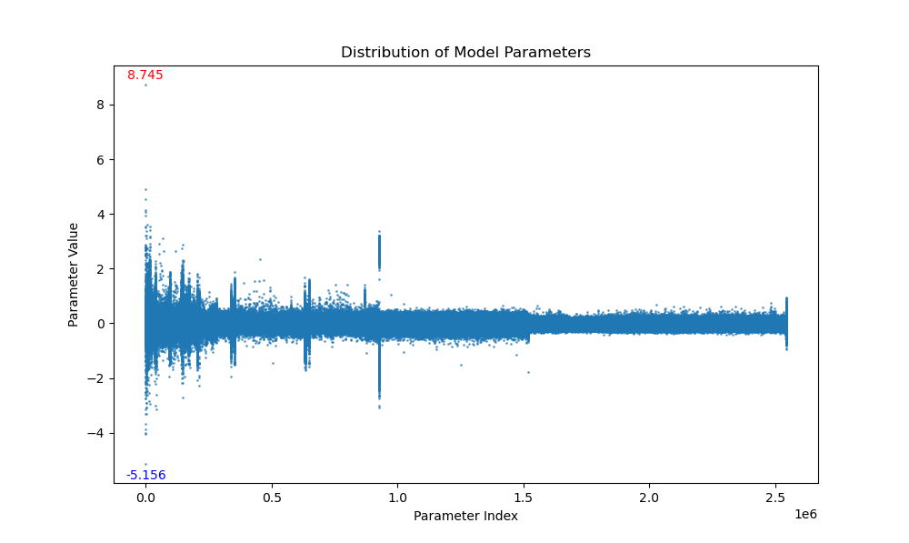

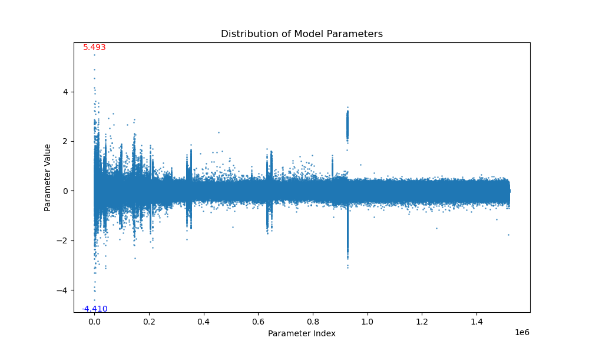

模型转换基本流程，参看手册可以实现对各种网络的转换。

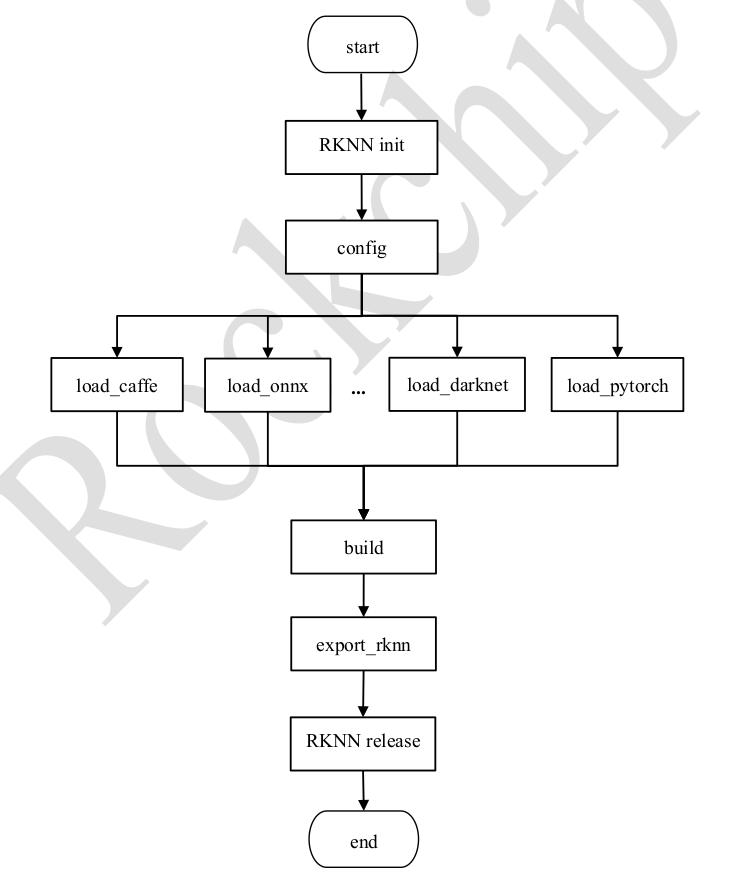

### 模型推理代码构建

模型推理代码的构建主要分为两方面：使用python代码进行连板推理、编译C/C++代码推送到板端进行推理。前者在验证初期比较方便，后者在部署阶段可以提升推理效率。

python端代码：该部分可参考 https://github.com/airockchip/rknn-toolkit2/blob/master/doc/03_Rockchip_RKNPU_API_Reference_RKNN_Toolkit2_V2.1.0_CN.pdf 文档，里面详细介绍了python端每个函数的作用。要使用该功能还需要提前在板端安装相关的server，可参考文档 https://github.com/airockchip/rknn-toolkit2/blob/master/doc/01_Rockchip_RKNPU_Quick_Start_RKNN_SDK_V2.1.0_CN.pdf。

C/C++编译后部署：该部分可参考文档 https://github.com/airockchip/rknn-toolkit2/blob/master/doc/04_Rockchip_RKNPU_API_Reference_RKNNRT_V2.1.0_CN.pdf，文档中详细介绍了板端API的使用方法。对于模型的具体使用流程参考 https://github.com/airockchip/rknn-toolkit2/tree/master/rknpu2。

如果对训练结果不满意或者自己的模型中出现了API中未定义的函数或算子，可以参考文档 https://github.com/airockchip/rknn-toolkit2/blob/master/doc/02_Rockchip_RKNPU_User_Guide_RKNN_SDK_V2.1.0_CN.pdf 。该文档中有很多细节的优化方式。

### 推理结果分析与优化

#### 调整参数后模型连板推理推理结果

调整模型与训练参数在rknn模型下板端推理三次结果：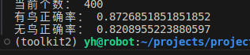

推理三次对第二三次的惩罚加大阈值为0.8：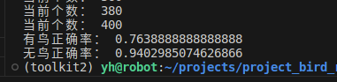

阈值0.85：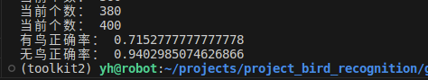

阈值0.75：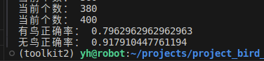

调整模型预训练参数在rknn模型下板端推理一次结果：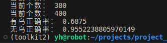

使用normal算法转换模型，不使用mmse，三次：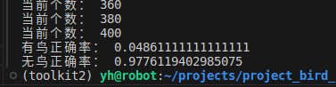

使用normal算法转换模型，不使用mmse，一次：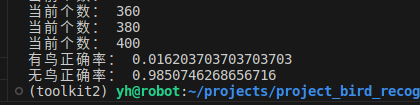

#### 未调整参数模型连板推理结果

未调整模型预训练参数在rknn模型下板端推理三次结果：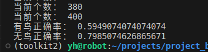

未调整模型预训练参数在rknn模型下板端推理一次结果：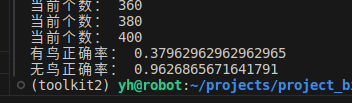

使用normal算法转换模型，不使用mmse，三次：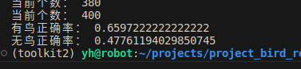

使用normal算法转换模型，不使用mmse，一次：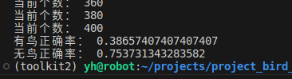

#### 结果分析

分析以上测试结果我们可以得出以下结论：调整outlier值对于提升板端推理正确率有极大提高，模型量化转换使用mmse算法性能优于normal算法，三次推理有助于提升模型准确率但需要结合惩罚阈值。

## 拓展

为了进一步提升模型在板端推理效率，可以尝试采用变形的数据训练模型，在测试和实际使用中也使用变形的数据。正方形图片仅通过一次推理即可确定有鸟还是无鸟。

数据集处理，对训练集、验证集、测试集均resize到256*256，其它参数和上面在非变形数据上训练保持一致。

### 训练结果

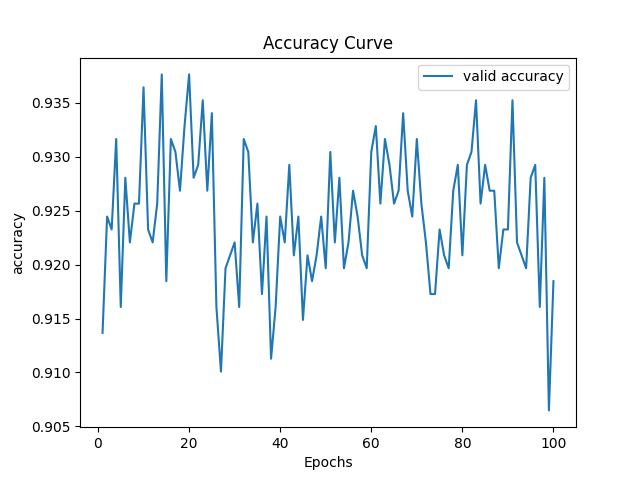

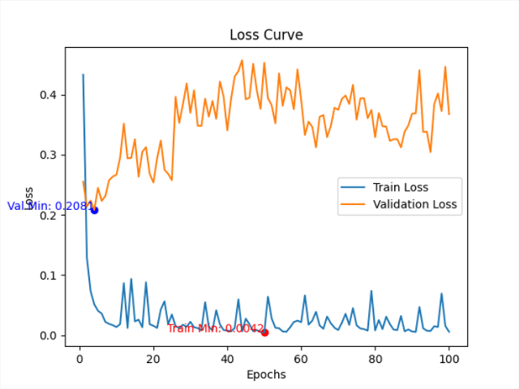

### 可视化结果

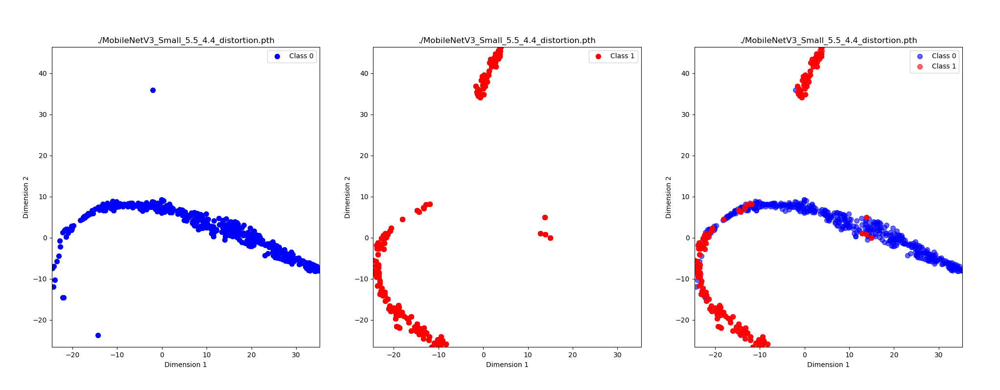

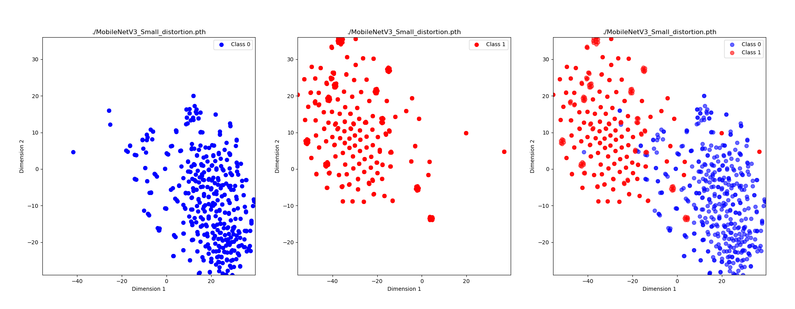

### 板端推理结果

正方形图片优点是只需要一次推理即可完成，但从结果上看不如使用不变形图片进行多次推理。

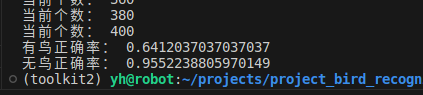
